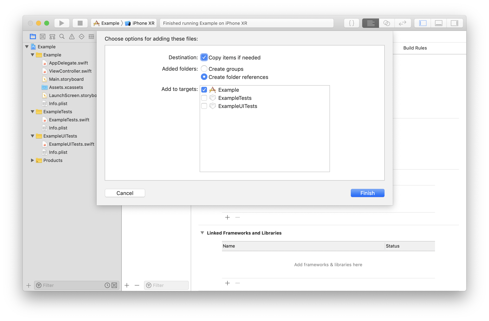
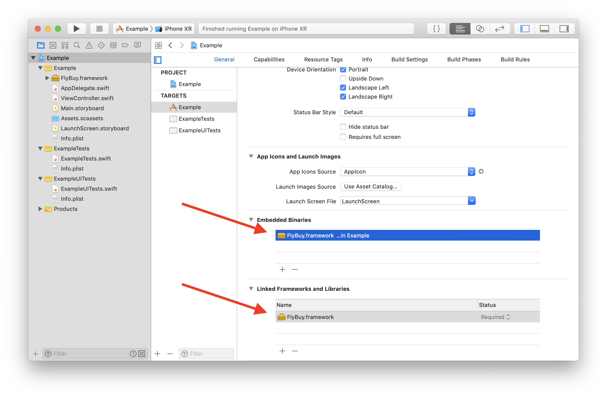
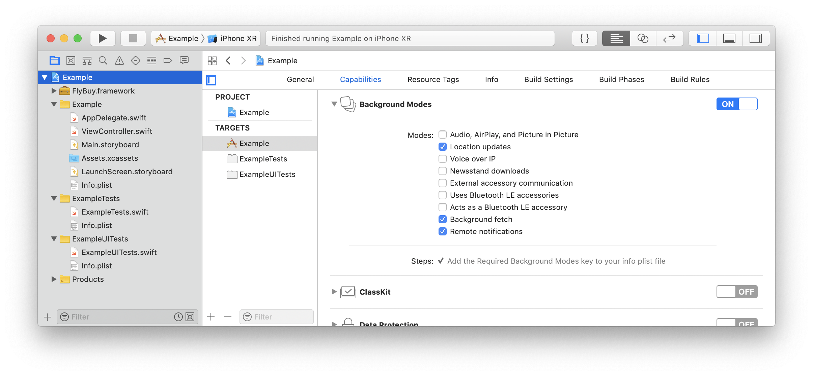
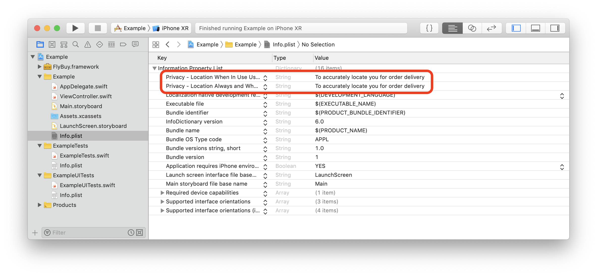

# Quick Start

## Getting Started

This guide will walk through the basic setup for integrating the FlyBuy SDK into an iOS app. There are a few things that need to be set up properly, we recommend following this guide carefully when first integrating with your app.

## Requirements

- iOS 11+
- Xcode 10+

## SDK Installation

Currently FlyBuy can be installed manually by dragging the framework bundle into Xcode.

CocoaPods and Carthage support will be coming soon. [Let us know](mailto:support@radiusnetworks.com) if you have a specific need.

### Manual Install

Download the [latest SDK release](https://github.com/RadiusNetworks/flybuy-ios/releases/latest).

After unzipping the SDK, drag `FlyBuy.framework` to your project in Xcode.

Make sure to check "Copy items as needed" and check the target for your app.



Confirm you have `FlyBuy.framework` in both the "Embedded Binaries" and the "Linked Frameworks and Libraries" sections of the "General" tab for your target.



Finally, you should verify build settings. Under the "Build Settings" tab for your target confirm:

- Enable Modules should be set to `Yes`
- Link Frameworks Automatically should be set to `Yes`

## Setting Permissions

In order to use the SDK your app will need to request the proper permissions.


### Enable Background Modes

Under the "General" tab for your iOS target, select Capabilities and scroll down to Background Modes. Enable Background Modes and select `Location updates` and `Background fetch`.



### Ask for Location Services permissions

FlyBuy uses mobile sensor data to identify the location of a customer.  The FlyBuy SDK requires Location services permissions to properly function. Specifically, the SDK needs the Location Always and When in Use permission.

If you are already asking users for the required permissions, you should review the usage description. The usage description explains why the application requires Always authorization.

If you currently do not ask users for the required permissions, you should add a usage description to your app. Usage descriptions are set in the `Info.plist` file.

A best practice is to explain why you are requesting location permissions prior to asking. This practice is known as "ask-to-ask."

| Name                                           | Suggested Description                       |
| ---------------------------------------------- | ------------------------------------------- |
| `NSLocationAlwaysAndWhenInUseUsageDescription` | To accurately locate you for order delivery |
| `NSLocationWhenInUseUsageDescription`          | To accurately locate you for order delivery |



## Import the library

In your `AppDelegate.swift` file, and any files that need to reference the FlyBuy library you will need to import it.

```swift
import FlyBuy
```

## Configure FlyBuy at launch

FlyBuy needs to be setup and configured at application launch. However, it does not run in the background or use device resources until there is an active order.

To configure everything properly pass your API token to the `configure` method on `FlyBuy`:

```swift
func application(_ application: UIApplication, didFinishLaunchingWithOptions launchOptions: [UIApplication.LaunchOptionsKey: Any]?) -> Bool {
  // Other setup

  FlyBuy.configure(["token": "TOKEN_HERE"])

  return true
}
```

If you don't already have an API token please contact your Account Executive or drop an email to [support@radiusnetworks.com](mailto:support@radiusnetworks.com) with the Project URL you want to enable, and we will set you up.

# Next Steps

Now that you have FlyBuy installed and configured, you need to integrate it with your app.

- [Handling Notifications](notifications.md)
- [Managing Customers](customer.md)
- [Managing Orders](orders.md)
- [Managing Sites](sites.md)
